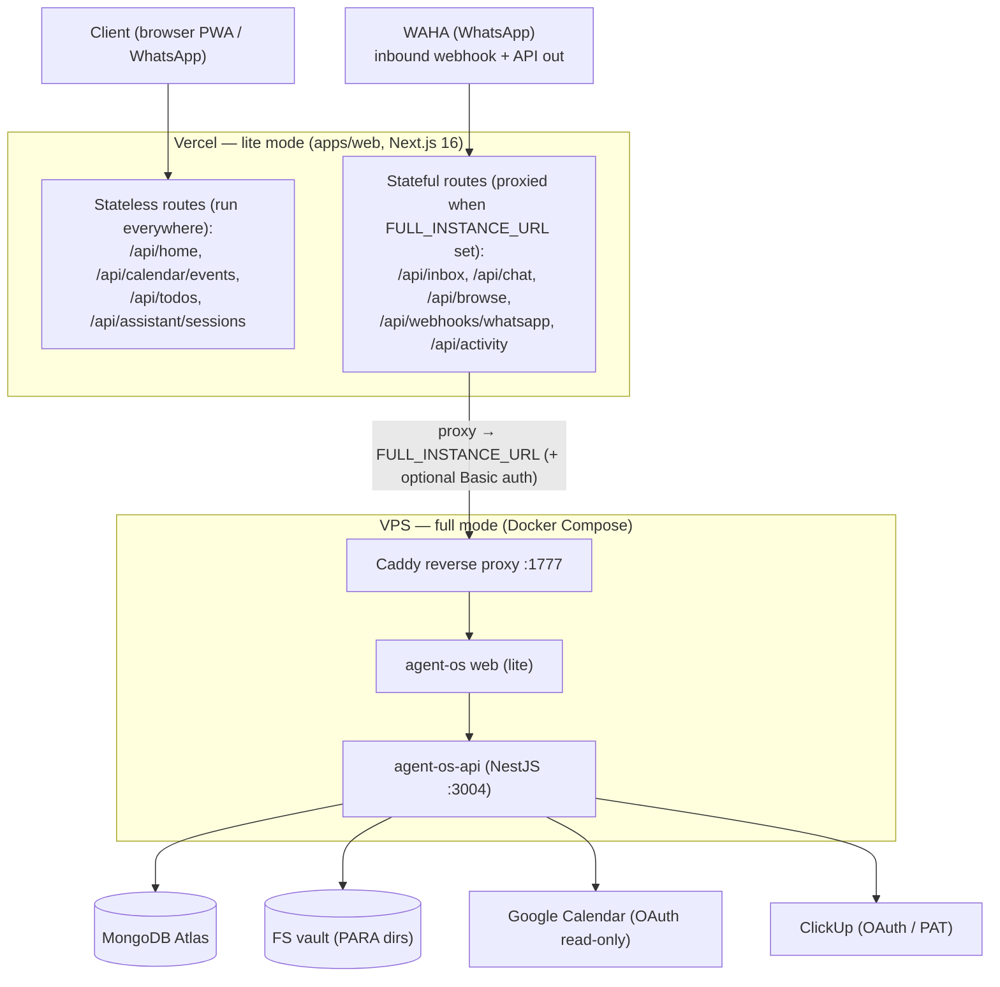
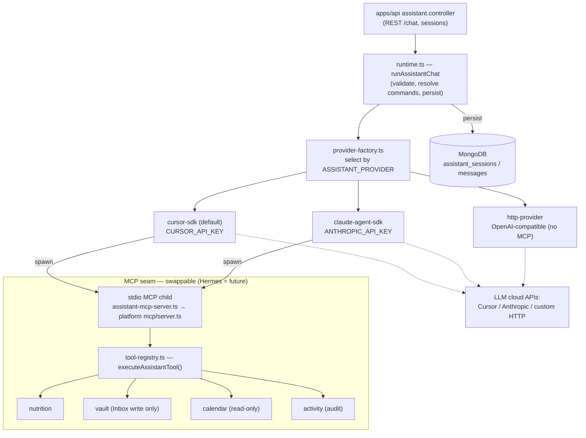
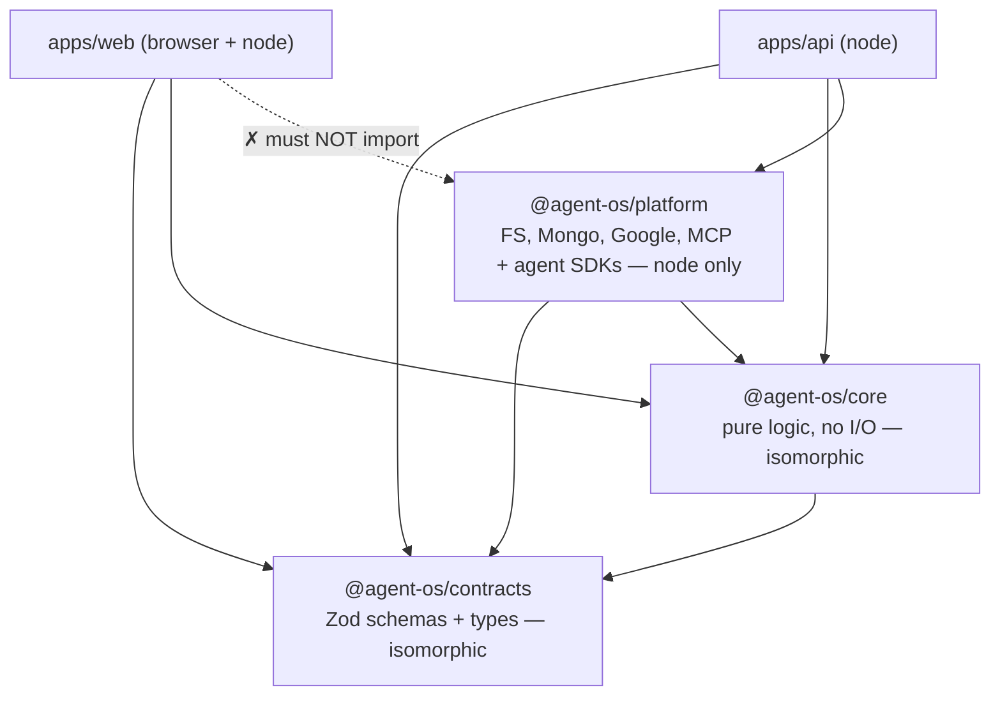

# Architecture

Agent OS is a pnpm + Turborepo monorepo. Two apps (`web`, `api`) sit on three
shared package layers (`contracts` → `core` → `platform`). The assistant runs
behind a swappable **MCP seam**, and the whole thing ships in two modes: a
stateless **lite** build on Vercel that proxies stateful work to a **full**
instance on a VPS.

> Editable source: [`architecture.drawio`](./architecture.drawio) — open in
> [draw.io](https://app.diagrams.net) (3 tabs: Deployment, Agent seam,
> Packages). The Mermaid below mirrors it for inline GitHub viewing; keep the
> two in sync when you edit.

## Deployment (lite ↔ full)

Lite (Vercel) serves stateless routes everywhere and proxies stateful routes to
the full VPS instance when `FULL_INSTANCE_URL` is set.

## Agent seam (pluggable providers behind MCP)

`runtime.ts` resolves the request, then `provider-factory.ts` picks a provider
by `ASSISTANT_PROVIDER`. The `cursor` and `claude` providers each spawn a
**stdio MCP child** exposing the assistant's tools; `http` talks to a plain
OpenAI-compatible endpoint with no tool-calling. The MCP boundary is the
swappable seam (a future Hermes provider slots in here).

## Package layering

`contracts` and `core` are isomorphic (browser + node). `platform` is node-only
I/O — **`apps/web` must never import it**; only `apps/api` may. Arrows point in
the import (depends-on) direction.

